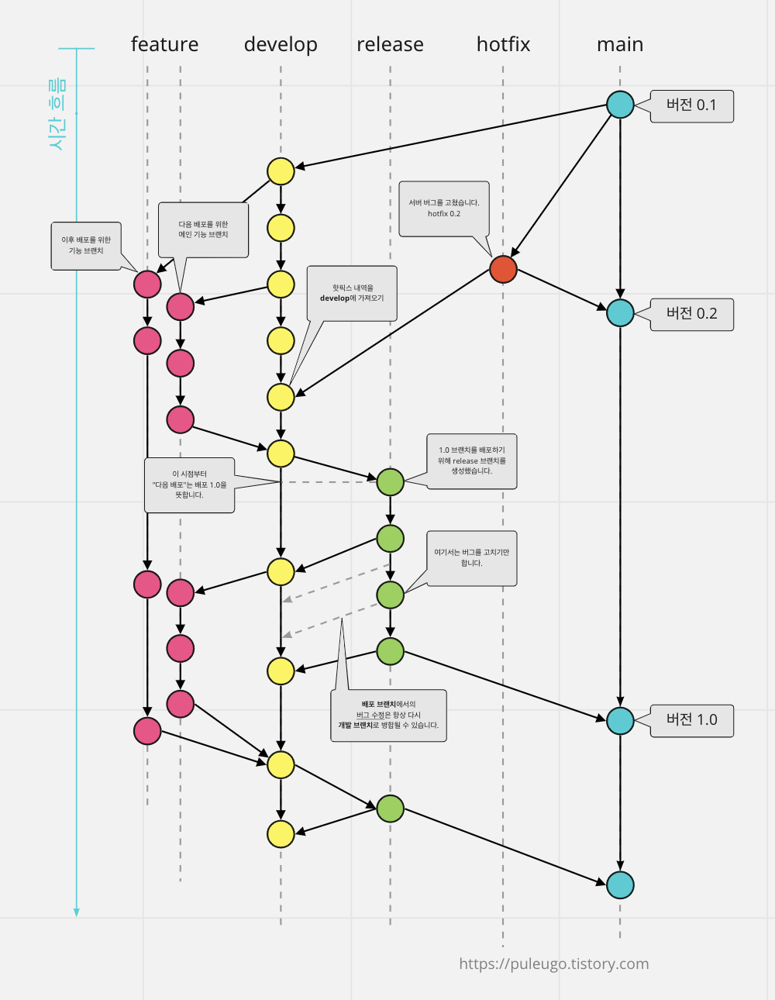
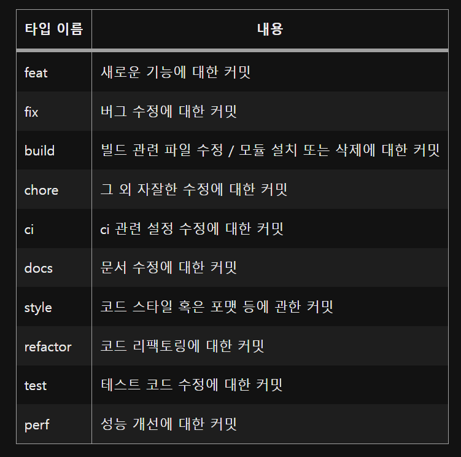

# Git_Project Repo Rules

*작성인 : 원효섭, 문성준*

## 1. git branch 전략

*출처 : https://puleugo.tistory.com/107*

## 2. git commit msg 규정

*출처 : https://velog.io/@chojs28/Git-%EC%BB%A4%EB%B0%8B-%EB%A9%94%EC%8B%9C%EC%A7%80-%EA%B7%9C%EC%B9%99*